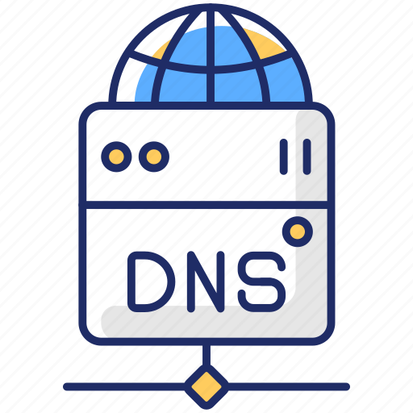

<p align="center">
  <a href="">
    
  </a>
  <h1 align="center">BIND9</h1>
</p>

### Step 1: Install Bind9

```
sudo apt update
sudo apt install bind9 resolvconf
```

### Step 2: Configure Bind9

**2.1. Edit the main Bind9 configuration file:**

```
sudo nano /etc/bind/named.conf.options
```

* Add or modify the following lines in the options section:

```
options {
    directory "/var/cache/bind";
    forwarders {
        8.8.8.8;
        8.8.4.4;
    };
    dnssec-validation auto;
    auth-nxdomain no;    # Disable DNSSEC error showing as SERVFAIL
    listen-on-v6 { any; };
};
```

In this example, we set Google DNS servers ``(8.8.8.8 and 8.8.4.4)`` as forwarders. Adjust them according to your preference.

**2.2. Create a new zone configuration file:**

```
sudo nano /etc/bind/named.conf.local
```

* Add the following lines to define your DNS zone:

```
zone "localhost" {
    type master;
    file "/var/cache/bind/db.localhost.com";
    allow-update { none; };
};

zone "x.x.x.in-addr.arpa" {
    type master;
    file "/var/cache/bind/db.x.x.x";
    allow-update { none; };
};
```

Replace ``localhost`` with your domain name and ``x.x.x`` with the reverse DNS zone corresponding to your IP address range.

**2.3. Create the forward zone file:**

```
sudo nano /var/cache/bind/db.localhost
```

* Add the following content and modify it according to your needs:

```
$TTL    604800
@       IN      SOA     localhost. root.localhost. (
                              2         ; Serial
                         604800         ; Refresh
                          86400         ; Retry
                        2419200         ; Expire
                         604800 )       ; Negative Cache TTL
;
@       IN      NS      localhost.
@       IN      A       127.0.0.1
@       IN      AAAA    ::1
```

Replace ``localhost`` with your domain name and ``127.0.0.1`` with the IP address of your DNS server.

**2.4. Create the reverse zone file:**

```
sudo nano /var/cache/bind/db.x.x.x
```

* Add the following content and modify it according to your needs:

```
$TTL    604800
@       IN      SOA     localhost. root.localhost. (
                              1         ; Serial
                         604800         ; Refresh
                          86400         ; Retry
                        2419200         ; Expire
                         604800 )       ; Negative Cache TTL
;
@       IN      NS      localhost.
1.0   IN      PTR     localhost.
```

Replace ``localhost`` with your domain name and ``1.0`` with the last octet of your server's IP address.

### Step 3: Restart Bind9

```
sudo systemctl restart bind9
```

### Step 4: Test the configuration

* You can check the status of Bind9 using the following command:

```
sudo systemctl status bind9
```

* Additionally, you can test the DNS resolution by running the following command:

```
nslookup example.com
```

OR

```
dig example.com @127.0.0.1
```