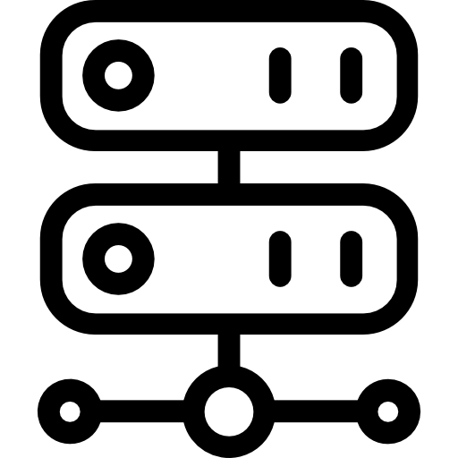

<p align="center">
  <a>
    
  </a>
  <h1 align="center">NETWORK INTERFACES + DHCP HELPER</h1>
</p>

### Step 1: Open the relevant network interface configuration file using a text editor.

- The file is located in ``/etc/network/interfaces``.

### Step 2: Locate the network interface definition connected to the DHCP clients network.

- It must be something like:

```
auto eth0
iface eth0 inet static
    address 192.168.10.1        # Replace with your desired IP address
    netmask 255.255.255.0       # Replace with your subnet mask
    gateway 192.168.10.254      # Replace with your gateway IP address
```

- Replace ``eth0`` with the name of the relevant network interface and update the IP address, netmask and gateway settings as needed.


### Step 3: Below the existing interface settings, add the line ``dhcp-helper`` followed by the IP address of the DHCP server.

- For example:

```
auto eth0
iface eth0 inet static
    address 192.168.10.1        # Replace with your desired IP address
    netmask 255.255.255.0       # Replace with your subnet mask
    gateway 192.168.10.254      # Replace with your gateway IP address
    dhcp-helper 192.168.20.100  # Replace with your DHCP Server IP address
```

- Replace ``eth0`` with the name of the relevant network interface and ``192.168.20.100`` with the IP address of the DHCP server on the other network.