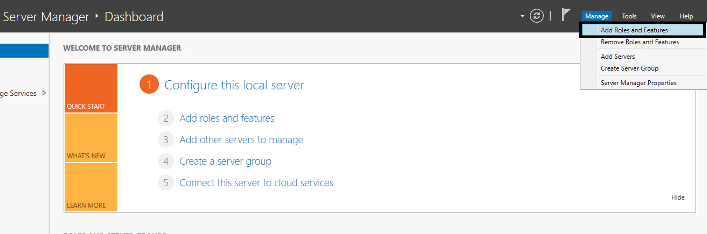

# AD DC

Installation from Server Manager

- Open Windows Server Manager and perform the required actions as they are highlighted in the following screenshots:

In Windows Server Manager choose Add Roles & Features under Manage

