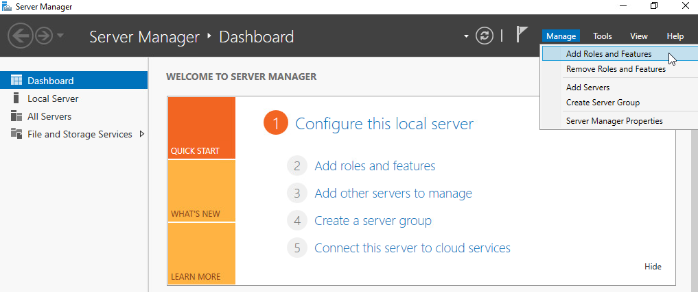
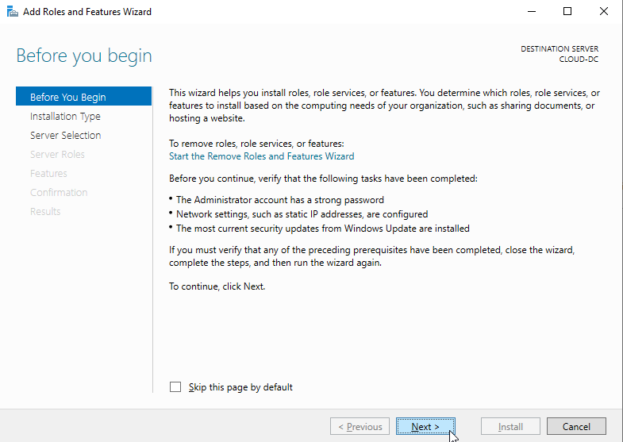
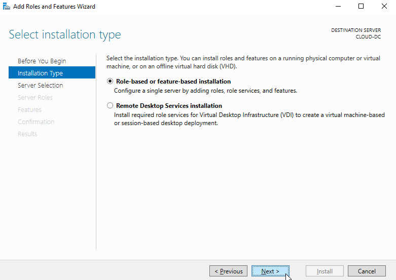
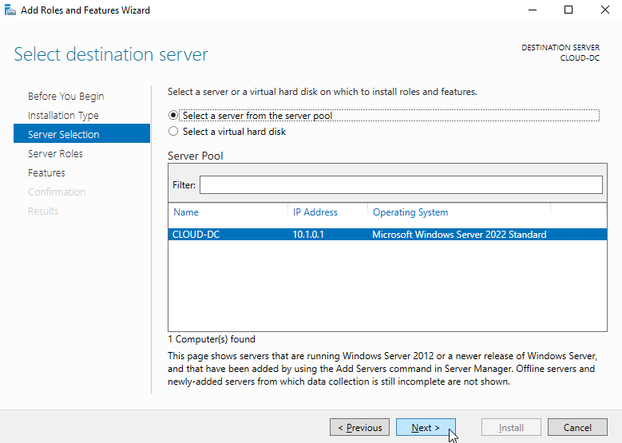

# AD DC

### Step 1: Login to Windows Server as an administrator and open the Server Manager as shown below:

### Step 2: Click on the Add Roles and Features. This will open the Add Roles and Features Wizard as shown below:

### Step 3: Click on the Next button. You will be asked to select the installation type as shown below:

Choose a role-based or feature-based installation

Choose the first option: Select a server from the server pool — you should see a single server auto selected and click 'Next'

https://www.ittsystems.com/active-directory-setup-guide/#wbounce-modal

https://akyriako.medium.com/install-the-routing-and-remote-access-server-rras-on-windows-server-2022-8b0c2d880507

